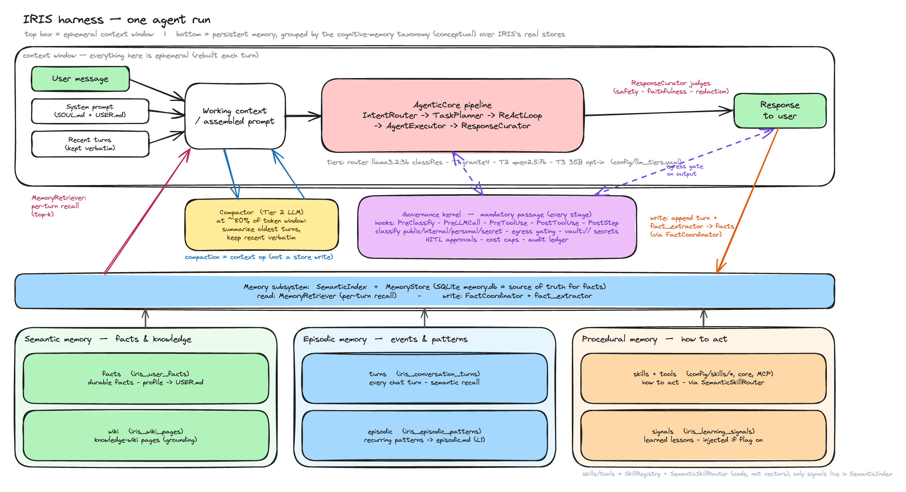
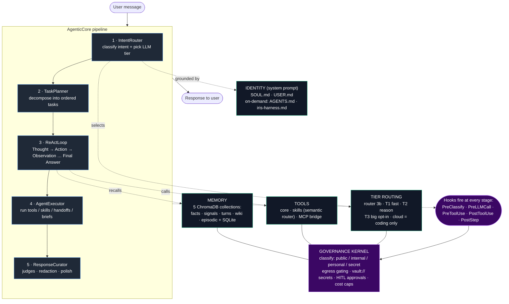

# IRIS Harness — High-Level Architecture Diagram

A basic, one-glance view of how the IRIS harness operates. This is an
intentionally simplified, hand-drawn **rough sketch** — a mental model, not an
exhaustive or normative spec. When it disagrees with the code, the code wins. For
the authoritative operational detail (stage-by-stage behavior, tiers, hooks,
memory model), see [`iris-harness.md`](./iris-harness.md); for design rationale see
`project-iris-prd/03-architecture-overview.md`.

## One agent run (hand-drawn)

Editable source: [`harness-architecture-diagram.excalidraw`](./harness-architecture-diagram.excalidraw)
(open at [excalidraw.com](https://excalidraw.com) or with the VS Code Excalidraw extension).

- **Top box = the ephemeral context window**, rebuilt each turn: inputs (user
  message + `SOUL.md`/`USER.md` system prompt + recent turns) → assembled prompt →
  the **AgenticCore pipeline** (IntentRouter → TaskPlanner → ReActLoop →
  AgentExecutor → ResponseCurator) → **Response to user**. Compaction
  (`compactor.py`, ~80% of the token window) is a context-window op, not a store write.
- **Bottom = persistent memory**, grouped under the standard cognitive-memory
  taxonomy as a *conceptual lens* over IRIS's real stores (the code does not name
  them this way): **semantic** = `facts` + `wiki`; **episodic** = `turns` +
  `episodic`; **procedural** = `skills`/`tools` + `signals`. One **Memory subsystem**
  block (`SemanticIndex` + `MemoryStore`, SQLite `memory.db` = truth) mediates
  reads (`MemoryRetriever`) and writes (`FactCoordinator` + `fact_extractor`).
  Note: `skills`/`tools` are code (`SkillRegistry` + `SemanticSkillRouter`), not
  vectors — only `signals` actually live in `SemanticIndex`.
- **Governance kernel = a cross-cutting layer, not a step.** Hooks fire at every
  stage — `PreClassify` · `PreLLMCall` · `PreToolUse` · `PostToolUse` · `PostStep`
  (mandatory passage; bypass is a CI failure) — enforcing classification
  (`public`/`internal`/`personal`/`secret`), egress gating, `vault://` secret
  resolution, HITL approvals, cost caps, and the audit ledger. The final
  `ResponseCurator` judges (safety / faithfulness / redaction) run in-process
  before the reply. See [`unified-governance-layer.md`](./unified-governance-layer.md).

## Simplified flow (text-based)

## Mental model

A message is **classified and routed** (IntentRouter → tier), **planned**
(TaskPlanner), then worked through a **ReAct loop** that calls **tools**
(core / skill / MCP), backed by a **5-collection memory** and grounded by the
**identity files**. Everything is wrapped by a **governance kernel** that tags data
`public/internal/personal/secret`, blocks personal data from leaving to cloud,
resolves secrets via `vault://` (never in prompts), and enforces HITL approval for
side-effecting actions. A final **ResponseCurator** runs safety/faithfulness judges
before the answer reaches the user.
