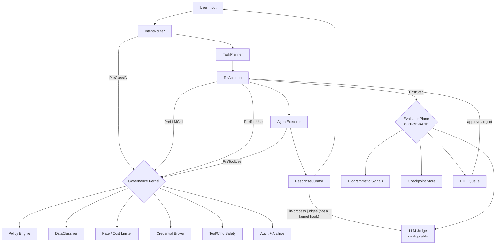

# Unified Governance Layer — Design

**Status:** Phases 1-5 shipped (Phase 5 multi-headed judge complete — safety/schema/consistency/faithfulness/leak/output_safety/**grounding**; grounding's ReAct retrieval-provenance prerequisite landed too). Phase 6 shipped shadow/opt-in (threat detection, MCP server signing, sandbox hardening — each default-off with a documented enforce/enable runbook). Verified in code 2026-06-18. **Note:** the "(Phase 4)" / "(Phase 5)" tags on file paths and sections below are *roadmap markers* (when the work was planned), not current status — see the "What's actually shipped" table immediately below for the authoritative map.
**Owner:** IRIS maintainers
**Created:** 2026-05-17
**Status last verified:** 2026-06-18
**Supersedes:** Scattered governance controls across `src/iris_harness/server/governor/`, `src/iris_harness/kernel/governor/`, `src/iris_harness/tools/sandbox/`, `src/iris_harness/llm/arbiter.py`, `src/iris_harness/tools/skills/`

---

## 0. What's actually shipped (authoritative map)

The phase markers throughout this doc (e.g. `# Phase 4`) reflect *when each piece was planned*. The table below is the current code reality — update it as parts land. If this table and a section header disagree, **this table wins**.

| Phase | Surface | Status | Evidence |
|---|---|---|---|
| 1 | Kernel skeleton; PreClassify / PreLLMCall / PreToolUse / PostToolUse / PostStep hook taxonomy (`PreResponse` is **defined but never fired** — see §12.x) | ✓ shipped | `src/iris_harness/kernel/governance/kernel.py`, `wiring.py` |
| 1 | Data classifier + egress gate (public / internal / personal / secret) | ✓ shipped | `src/iris_harness/kernel/governance/wiring.py` (DataClassifierHook + ToolPolicyHook) |
| 2 | Vault store + CredentialBroker + `vault://` handles | ✓ shipped | `src/iris_harness/kernel/governance/vault/` |
| 2 | Outbound redaction filter (regex packs) | ✓ shipped | `governance/vault/` redaction |
| 2 | Skill manifest `required_credentials` | ✓ shipped | `src/iris_harness/tools/skills/models.py:RequiredCredential` |
| 3 | Out-of-band evaluator (loops / goal drift / step cap) | ✓ shipped | `src/iris_harness/kernel/governance/evaluator/` |
| 3 | Checkpoint store + resume | ✓ shipped | `src/iris_harness/memory/state/` (M6.2 layer 4 moved it out of the kernel) |
| 3 | Cost ceiling per run | ✓ shipped | `src/iris_harness/kernel/governance/cost/` |
| 4 | Per-persona tool surface (`allowed_tools`, `blocked_tools`) | ✓ shipped | `governance/plugins/persona_surface.py`, `wiring.py:161` |
| 4 | `fs_write_jail` | ✓ shipped | `governance/plugins/fs_jail.py` |
| 4 | `network_egress_domains` allowlist | ✓ shipped | `governance/plugins/network_egress.py` |
| 4 | `command_allowlist` / command sandbox | ✓ shipped | `governance/plugins/command_sandbox.py` |
| 4 | MCP per-persona allowlist (`(persona, server, tool)`) | ✓ shipped | `governance/plugins/mcp_allowlist.py` |
| 4 | HITL approval queue + lifecycle | ✓ shipped | `governance/approvals/{queue,store}.py`, `cli/approvals.py` |
| 4 | Side-effect ledger | ✓ shipped | `kernel/governance/side_effects/`, `PostToolUseLedgerHook` |
| 4 | `persona-policy.yaml` for the coding agent | ✓ shipped | `src/iris_code/resources/config/persona-policy.yaml` |
| 5 | Parquet + zstd cold archive | ✓ shipped | `governance/audit/archive/writer.py` |
| 5 | DuckDB analytics over hot+cold audit | ✓ shipped | `governance/audit/archive/query.py` |
| 5 | Response Curator faithfulness judge | ✓ shipped | `core/response_curator.py:FaithfulnessJudgeClient`, `runtime/bootstrap.py:_CuratorFaithfulnessLLMJudge` |
| 5 | Multi-headed judge breadth — safety / schema / consistency / faithfulness / leak signals wired into `_run_pre_response_judges` (with retry/repair + halt) | ✓ shipped | `core/response_curator.py:_run_pre_response_judges` (~287-372), `JudgeBundle` / `JudgeSignal` |
| 5 | `grounding` judge signal (+ ReAct retrieval-provenance capture) | ✓ shipped (opt-in `IRIS_CURATOR_GROUNDING_LLM`) | `core/response_curator.py:_judge_grounding`, `core/provenance.py`, `runtime/bootstrap.py:_build_curator_grounding_client` |
| 6 | Prompt Guard / Llama Guard threat-detection plugins (G1/G2/G3 + battery) | ✓ shipped (shadow, opt-in) | `governance/threat/`, `governance/plugins/prompt_guard.py`, `core/response_curator.py:_judge_output_safety` |
| 6 | MCP server signing | ✓ shipped (shadow, opt-in) | `governance/mcp_signing/`, `tools/mcp_bridge.py:_enforce_signature`, `cli/mcp.py` |
| 6 | Sandbox upgrade (gVisor) | ✓ shipped (docker default, gVisor opt-in) | `sandbox/runtime.py`, `sandbox/docker_sandbox.py:GVisorSandbox` |

When you add a new governance primitive, add a row here and link the file.

---

## 1. Why this doc

IRIS started as a privacy-first, local-first agentic platform: private/proprietary data stays on local LLM tiers, cloud LLMs are reserved for complex reasoning the user explicitly opts into. Today that promise is **stated in config but not enforced at runtime**. The Governor microservice is real and well-designed, but only the MCP bridge actually calls it. AgenticCore, the tier router, the coding agent, and skill execution all bypass it.

This doc unifies governance into a single mandatory-passage enforcement plane covering:

- **Data classification + egress gate** — runtime enforcement of "private data never leaves local tiers"
- **Hook framework** — one taxonomy, all agent components hit it
- **Credential broker (vault)** — secrets never appear in prompts
- **Tool & command safety + persona-level governance** — declarative allowlists, FS jail, network egress, MCP allowlist
- **ReAct loop evaluation + checkpointing** — catch loops, goal drift, runaway cost; pause and resume
- **HITL approval queue** — pluggable channels, durable state
- **Response Curator as multi-headed judge** — grounding, faithfulness, safety, schema, consistency
- **Audit + analytics-grade archive** — tiered storage with retention forever
- **Out-of-band isolation** — the evaluator cannot be influenced by the agent it evaluates

---

## 2. Standards alignment

This design grades against:

- **NIST AI RMF + GenAI Profile (AI 600-1)** — GOVERN/MAP/MEASURE/MANAGE for the 12 GenAI-specific risks (data privacy, info-security, malicious-actor enablement, confabulation, etc.)
- **OWASP Top 10 for LLM Applications 2025** — LLM01 Prompt Injection, LLM02 Sensitive Info Disclosure, LLM06 Excessive Agency, LLM07 System Prompt Leakage, LLM10 Unbounded Consumption
- **OWASP Top 10 for Agentic Applications 2026** — ASI01 Goal Hijack, ASI02 Tool Misuse, ASI03 Identity & Privilege Abuse
- **ISO/IEC 42001:2023** — AI Management System lifecycle, change management
- **EU AI Act** — Article 26 (deployer obligations: action logs, human oversight), Article 50 (transparency)
- **MITRE ATLAS** — agent-specific adversarial techniques (Oct 2025 additions)
- **Stanford 2026 critique** — "kill switches don't work if the agent writes the policy"; evaluation plane must be out-of-band

---

## 3. Current state — gap matrix

| Control bucket | Today | Target |
|---|---|---|
| Identity & AuthZ | Route-level policy only | Per-agent identity, per-(user, agent, tier) scopes, model-level ACL |
| Policy & Routing | YAML routes, approval flag, MCP-only enforcement | Mandatory passage from all AgenticCore stages + coding pipeline |
| Data Egress & Privacy | Cloud route gated in config | Runtime classification + egress denial for `personal`/`secret` |
| Tool & Command Safety | Docker sandbox, `AllowedTool` enum | Command allow/deny list, FS jail, network egress firewall, MCP server signature, per-persona surface |
| Resource & Cost Limits | Per-route RPM, local thermal governor | Per-user/agent/tier scoping, TPM, enforced cost ceiling, ReAct step cap |
| Observability & Audit | Append-only SQLite | Tiered: hot SQLite + cold Parquet+zstd archive, analytics-ready, never purged |
| Threat Detection | None | Prompt-injection classifier, jailbreak heuristics, output policy, RAG sanitization |
| Lifecycle | Approval flag | HITL queue, circuit breakers, out-of-band kill switch, side-effect-aware resume |
| Vault | Declared, not implemented | Credential broker with handle-based access; tools never see raw secrets |

---

## 4. Architecture



**Key properties:**

1. **One enforcement point** (`GovernanceKernel`) for all policy decisions. Hooks fire from every AgenticCore stage and the coding pipeline; none of them choose whether to call it.
2. **Evaluator plane is out-of-band.** The agent cannot read its policy, write to its store, or influence its judgements via prompt content. Separate process boundary, separate DB schema with read-only-to-agent enforcement.
3. **Vault is a service, not a config.** Tools fetch credentials by handle; secrets never enter the LLM prompt path.
4. **Fail-closed for cloud egress + tool execution.** Fail-open for local-only LLM calls (see §4.1).

### 4.1 Deployment shape & fail-closed posture

#### Embedded for the common path, HTTP for cross-service

The `GovernanceKernel` runs **embedded in-process** for the CLI / agent path (no IPC overhead, no "is the governor running" problem when starting `iris run` or `iris-code`). The HTTP service at `src/iris_harness/server/governor/` (port 8080) wraps the same kernel and exposes it for cross-service calls (Dashboard, Background Worker, Channel Gateway, future Voice service).

```python
# Common path — embedded
from iris_harness.governance.kernel import GovernanceKernel
kernel = GovernanceKernel.from_config()  # in-process
decision = await kernel.fire(HookPoint.PreLLMCall, ctx)

# Cross-service — HTTP wrapper around the same kernel
POST :8080/guard/{route}
```

Both paths share the same plugin registry, same audit DB, same policy file. The HTTP wrapper is a thin shim.

#### Fail-closed posture

If a required plugin fails (classifier model unavailable, vault DB locked, audit write failure, policy file unreadable, etc.):

| Path | Posture | Why |
|---|---|---|
| Cloud LLM egress (`llm/cloud/*`) | **Fail-closed** | Privacy promise must not silently bypass |
| Tool execution (file write, command exec, network, git, github, MCP, skill) | **Fail-closed** | Side effects must not happen unguarded |
| Local LLM call (Tier 1, Tier 2) | **Fail-open with WARN audit** | Don't break offline operation; log degraded mode |
| Classifier failure | **Fail-closed for cloud**, fail-open for local | Conservative on unknown content where it matters |
| Audit write failure | **Fail-closed everywhere** | A run that can't be audited can't proceed |
| Vault unavailable | **Fail-closed for tools requiring credentials**, fail-open for tools that don't | Credential-free tools should not be blocked by vault outages |

Every fail-open event writes a `WARN`/`ERROR` audit entry. A circuit breaker tracks fail-open frequency: more than N fail-opens in a 60s window escalates the kernel to **global fail-closed mode** until manually cleared (`iris governance reset-degraded`). This prevents silent drift into permissive operation.

---

## 5. Hook framework

Modeled on the Claude Agent SDK hook taxonomy. One signature, six hook points, plugin model.

### 5.1 Hook points

| Hook | Fires | Plugins |
|---|---|---|
| `PreClassify` | IntentRouter receives raw input | `DataClassifier`, `PromptInjectionDetector` |
| `PreLLMCall` | Just before any LLM provider call | `EgressGate`, `RateLimiter`, `CostLimiter`, `RedactionFilter` |
| `PreToolUse` | Before tool/skill invocation | `Policy`, `RateLimiter`, `CredentialBroker`, `CommandSandbox`, `PersonaSurface`, `FSJail`, `NetworkEgress` |
| `PostToolUse` | After tool returns | `OutputClassifier`, `OutputRedactor` |
| `PostStep` | After Thought→Action→Observation cycle in ReAct | `Evaluator`, `CheckpointWriter` |
| `PreResponse` | **Defined but never fired** — `ResponseCurator` runs its `JudgeBundle` **in-process** (`_run_pre_response_judges`), deliberately outside the kernel | (in-process judges) |

### 5.2 Hook signature

```python
class HookDecision(BaseModel):
    outcome: Literal["allow", "deny", "transform", "require_approval"]
    transformed_payload: dict[str, Any] | None = None
    reason: str
    approval_request_id: UUID | None = None
    severity: Literal["info", "warn", "error", "critical"] = "info"
    audit_metadata: dict[str, Any] = {}

class Hook(Protocol):
    name: str
    hook_point: HookPoint
    priority: int  # lower = earlier

    async def __call__(self, ctx: HookContext) -> HookDecision: ...
```

### 5.3 Plugin trust boundary

Hooks observe every prompt, every tool call, every credential handle resolution. Registering one is equivalent to root in the governance plane. The trust boundary in v1 is therefore tight:

| Source | Can register hooks in v1? | Future |
|---|---|---|
| `src/iris_harness/kernel/governance/plugins/` (ships with IRIS, reviewed in PR) | ✓ | ✓ |
| Skills (`src/iris_harness/tools/skills/`) | ✗ | After skill signing exists, signed skills may register hooks scoped to their own tool calls only |
| MCP servers | ✗ | After MCP server signing (Phase 6) |
| Auto-proposed quarantined skills | ✗ | Never |
| Extensions registered via `ExtensionAPI` | ✗ | After signing |

The hook registry is loaded once at kernel init from `src/iris_harness/kernel/governance/plugins/__init__.py`. Runtime registration is not supported. A test (`test_no_runtime_hook_registration.py`) asserts this — any attempt to add a hook after kernel init must raise.

Hooks themselves are pure functions of `HookContext`; they have no read/write access to the agent's working memory, retrieval context, or trace beyond what the kernel provides in the context object.

### 5.4 Mandatory passage

`AgenticCore` stages and the coding pipeline call `await kernel.fire(hook_point, ctx)` — this is not optional. A test (`test_no_bypass.py`) asserts every LLM call site, every tool invocation, and every cloud egress path passes through the kernel; CI fails if a new path is added without a hook.

---

## 6. Data classification + egress gate

The core of the privacy promise.

### 6.1 Taxonomy

Four classes, each with a maximum allowed LLM tier:

| Class | Examples | Max LLM tier | On cloud attempt |
|---|---|---|---|
| `public` | Open-domain questions, web search results | Tier 3 (cloud) | Allow |
| `internal` | Project notes, code snippets without secrets | Tier 3 with redaction | Auto-redact, send |
| `personal` | Names, contacts, addresses, voice transcripts | Tier 2 (local 9B) | **Ask user** |
| `secret` | API keys, passwords, tokens, vault contents | Tier 2 (any local model) | **Hard block** |

IRIS-specific extensions to bake in (you noted these as relevant): `voice-transcript`, `telegram-message`, `coding-agent-secret`. These are sub-tags on `personal` / `secret`.

### 6.2 Classifier (two-stage)

**Stage 1 — Presidio + regex packs (always-on, ~5–20ms):**

- Microsoft Presidio for PII (email, phone, SSN, credit card, person name, location)
- Regex packs for credentials: API key patterns (AWS, GitHub PAT, OpenAI, Anthropic, OpenRouter), JWT, private keys, `.env` line patterns
- IRIS-specific packs: telegram bot tokens, voice transcript markers, vault handles

**Stage 2 — LLM classifier (escalation, configurable model):**

- Runs only when Stage 1 returns "ambiguous" (e.g., contains a name but unclear context)
- **Configurable** — default Tier 2 Nemotron; user can plug in a custom small fine-tuned model
- **Off by default; opt-in per task or via complexity heuristic** (long prompts, ambiguous Stage 1)

### 6.3 Enforcement policy (per-class)

Implemented in `EgressGate` hook firing at `PreLLMCall`. The class→tier table is config,
`config/governance/egress.yaml` (loaded and validated by
`kernel/governance/egress_policy.py`, once, when the kernel is built; an owner config dir
without the file reads the shipped one):

```yaml
classes:
  secret:
    max_tier: tier_2            # local only: any local model, never tier_3
    on_violation: deny          # critical; the loader refuses anything else
  personal:
    max_tier: tier_2
    on_violation: require_approval
  internal:
    max_tier: tier_3            # the gate adds a warn + would_redact hint at tier_3
  public:
    max_tier: tier_3
```

The tiers mean locality (see "governed by where its model runs" below): `tier_1` and
`tier_2` are models on the owner's machines, `tier_3` leaves them. Redaction of an inline
secret (`RedactionFilterHook`, vault-handle substitution) runs before the gate, as before.

**`secret` is local only (owner decision, 2026-09-30).** Secret data may reach any local
model, `tier_1` or `tier_2`, and never `tier_3`; a violation is a hard deny, never an
approval. This replaced "secret may reach only `tier_1`", which dated from when the tiers
meant model size: once `tier_1`/`tier_2` both meant "runs on the owner's machines" (#744),
refusing a secret turn the larger local model protected nothing and broke the turn (its
search step runs on `tier2`). The loader refuses a table that sets `secret` to `tier_3`
or lets it ask, so the rule cannot be loosened from config; a table may tighten it (back
to `tier_1`).

**"Local" includes the owner's own hosts over the owner's own network.** A provider
declared `runs: local` in `llm_tiers.yaml` may be a host the owner controls, reached over
the owner's tailnet: the cloud VM uses the Mac's Ollama that way. So a `secret` prompt may
cross the owner's private network to the owner's own machine. It never reaches a third
party's service: a third-party provider is `runs: cloud` (or undeclared, which governs as
cloud), and `tier_3` is refused.

### 6.4 Power-user "trust this provider" mode

Per-session escape hatch: `iris config set egress.cloud_trusted_for=[internal,personal]` allows skipping `ask_user` for trusted cloud providers (still hard-block `secret` always). Logged with elevated severity to audit.

### 6.5 Output classification

`PostToolUse` hook tags tool outputs with their highest detected class. ReAct loop propagates the tag: if a tool returns `personal` data, the next LLM call is constrained to Tier 2 even if the original prompt was `public`. Tag propagation prevents leakage via tool round-trips.

---

### 6.5 Output classification propagation (PostToolUse)

The run's classification used to be derived once, from the user's question, and cached
for the rest of the run. "Wondering how my day looks like ?" classified `public`, the
`daily_plan` tool put the inbox into the prompt, and every later `egress_gate` decision
was still made against `public` with personal data in context. The gate answered
correctly for the inputs it had; the inputs were stale. Nothing fired `PostToolUse` at
all, so the side-effect ledger and the G2 injection guard were registered and never ran.

`OutputClassifierHook` (priority 10, `PostToolUse`) re-derives the label from the tool
result and returns `set_classification` when the result is more sensitive than the run.
`AgenticCore._governance_post_tool` fires the hook point from **both** ReAct loops and
threads the raised label into the next `PreLLMCall`.

Classification only ever rises. A later harmless tool result cannot restore `public`,
because the prompt keeps the personal content for the rest of the run.
`src/iris_harness/kernel/governance/plugins/output_classifier.py`

**The turn's label (2026-09-30).** A plugin's code calls (`api.tools`, `api.capability`)
are not the loop's, so the loop's label never reached them. The turn pipeline now publishes
the turn's label for the whole turn (`kernel/governance/turn_label.py`, scoped in
`runtime/turn/pipeline.py:137` for `chat`, `chat_stream` and resume; seeded by `screen`
from `PRE_TURN`). The harness stamps it on every code call (`runtime/tool_service.py:132`,
`runtime/plugin_host/registry.py:221`); the caller cannot set it. Every governed call's
`POST_TOOL_USE` lifts it (`agent/tool_runner.py:472,749,766`), never lowers it, and the loop
floors its own label on it before each `PreLLMCall` (`agent/agentic_core.py:2245`), so a
result a plugin pulled into the turn governs the model calls after it. Outside a turn
nothing is stamped and a lift is a no-op.

**Identity on every row (G10).** Every `pre_llm_call` row names the `model` and `provider`
it governs: the shared client and the loop's step (`AgenticCore(model_identity=...)`, asked once per
step in `runtime/handlers/react.py`: the router's answer is kept for the step's call, so the row
names the model that is called and the router, with its governor/arbiter side effects, is
asked once per step); a caller that fires the hook
around an opaque callable (`TaskPlanner`, `IntentRouter`, `ConversationCompactor`,
`EntityExtractor`) cannot know the model behind it and says `unknown`. Every
`pre_tool_use` / `post_tool_use` row names its owner as `tool_plugin` (not `plugin`, which
on a row is the governance check that wrote it): the plugin that registered the tool
(stamped on `ToolSpec.plugin` by `PluginAPI.declare_tool` / `PluginRegistry.add_tool`),
`skill:<name>` for a skill package's tool, `mcp:<server>` for a bridged server's tool
(`tools/mcp_bridge.py`), the capability's provider for a capability call, and `system` for
a core tool. A request a plugin makes through the governed HTTP client fires `pre_egress` / `post_egress` (`plugin_egress` hook; `docs/architecture/plugin-egress.md`), whose rows carry the same `tool_plugin`, `tool_name` and `caller` plus an `egress` value (host, port, scheme, method, outcome; never a path, query or body). Both are in the audit whitelist (`kernel._AUDITED_PAYLOAD_KEYS`) and the
public fields (`audit_view.PUBLIC_PAYLOAD_FIELDS`, so `model`, `provider` and `tool_plugin`
reach `GET /governance/audit`, `iris governance audit` (its `by` column) and the trace); the stable `TurnAuditRow` exposes
`caller` and `tool_plugin`.

**Which call a row is about (#134, stage 1).** The runner mints one ULID `call_id` per call
attempt (`foundation/ids.py`; `GovernedToolRunner.execute`, the three capability entry points
and the MCP bridge's outbound calls), before `PRE_TOOL_USE`. `kernel._audit` stamps it, from
the context's kernel-set metadata only, on every `pre_tool_use` / `post_tool_use` row of the
call; the side-effect key is `<run_id>:<step_id>:<call_id>`; the session log's `tool.invoke.*`
events carry it (beside the old `tool_call_id`, same value); and the approvals queue's one new
nullable column, `call_id`, keeps a held attempt's id. The approved re-execution is a new call:
its rows carry `held_call_id`. `call_id` and `held_call_id` are public payload fields (identifier
only). Model calls and the general lane's builtin tools mint none yet. Design:
`call-identity-and-audit-replay.md`.

**Every model call in the turn, not only the loop's (2026-09-30).** One rule,
`apply_turn_floor` (`kernel/governance/turn_label.py`), sets the label of every
`PreLLMCall` in the turn: the loop, the shared client (`llm/client.py:901` -- curator
judges, narration, fact capture, the general handlers) and the callers that fire the hook
themselves (`TaskPlanner`, `LLMClassifier`, `ConversationCompactor`, `EntityExtractor`,
each in `_invoke_with_governance`). A prompt that
classifies tamer than the turn is governed as the turn, so a personal turn cannot reach a
cloud tier through a narrator or judge prompt. One declared exemption: a client built with
`governance_stripped_public_content=True` (only the cloud search-synthesis client,
`runtime/handlers/react.py`) reads personal as internal; `secret` is never lowered.

**A call is governed by where its model runs, not by its tier's name (2026-09-30).** The
gate's `tier_3` means "the prompt leaves the owner's machines". It was read off the tier
name, so the local LM Studio model configured as `tier3` governed as cloud and a personal
turn needed approval for a call that never left the Mac. Each provider now declares where
it runs in `llm_tiers.yaml` (`providers: {<name>: {runs: local|cloud}}`, both the Mac
and the VM file; a file with no block inherits the shipped one's); `runs: cloud` or
undeclared is `tier_3`, a local tier is `tier_1`/`tier_2`
by size (`llm/tier_router.governance_tier_for`). The router stamps that label on every
config it builds (`CodingLLMConfig.governance_tier`); a config it did not build (a
provider profile, a `/model` override) is labelled from the provider's declaration
(`llm/locality.py`). The four callers that took a bare `llm_call` and fired their own
`PreLLMCall` under a hardcoded `tier_1` fire nothing around a `GovernedPromptCall`
(`llm/client.py`; the compactor's summarizer in production), whose client governs the call
once at its real tier; around an opaque callable they govern it as `tier_3` (fail closed).

**A secret turn's search step runs locally (2026-09-30).** When the egress gate refuses
the cloud search-synthesis client (a `secret` turn; the kernel stamps
`HookDecision.decided_by`), the step runs on the local tier the loop would have used,
which the loop's own `PreLLMCall` has already governed, and a `search_synthesis_fallback`
row lands in the ledger. Nothing is sent to the cloud client. Any other refusal or error
stands. On the shipped tiers `search` runs on `tier2` (`tier_2`), and `secret` is local
only (§6.3), so the loop's own gate lets the step through and the fallback runs it on
`tier2`: the answer comes from the local model and the cloud transport is never dialed
(`tests/unit/iris_harness/runtime/test_bootstrap/test_search_synthesis_fallback.py`).

---

## 7. Credential broker (Vault)

Secrets are never embedded in prompts. Tools fetch them by handle at execution time.

### 7.1 Model

- Storage: encrypted SQLite at `~/.config/iris/vault.db`, key derived from OS keychain
  - **Implementation note:** v1 ships Fernet (AES-128-CBC + HMAC-SHA256) over a SQLite blob column rather than sqlcipher full-page encryption. The at-rest property is equivalent (an attacker who steals `vault.db` cannot decrypt without the master key), and avoiding the native `libsqlcipher` build keeps `pip install iris` working on stock macOS/Linux dev installs. Migrating to sqlcipher is a one-shot rewrite of `src/iris_harness/kernel/governance/vault/store.py` if column-level encrypted search ever becomes a requirement.
- Each secret has a **handle** (e.g., `vault://github-pat-coding`), a `governor_route` it can be released to, and an optional TTL
- Tools declare their required handles in `manifest.yaml`:
  ```yaml
  required_credentials:
    - handle: vault://github-pat-coding
      route: coding/github
  ```
- At `PreToolUse`, the broker resolves handles → raw secrets → passed to the tool process via environment (never via LLM prompt)
- The kernel's redaction filter scans outbound prompts for raw secret values; if a raw secret leaks into a prompt, it's automatically substituted with the handle and an audit alert fires

### 7.2 Migration path

- v1 ships the broker + a `iris vault import-env` command that migrates the current `.env` secrets into the vault
- `.env` continues to work as fallback during migration; deprecated in v1.1

---

## 8. Tool & command safety + persona-level governance

The kernel covers data egress and approvals; the tool-execution surface needs its own enforcement set. The coding agent is the highest-risk consumer — it runs commands, edits files, opens PRs, hits cloud LLMs constantly.

### 8.1 Per-persona declarative tool surface (coding agent)

Each persona (`orchestrator`, `analyst`, `architect`, `developer`, `tester`, `sm`, `ux-designer`) declares its tool surface in `src/iris_code/resources/config/persona-policy.yaml`. Enforced by the `PersonaSurface` plugin at `PreToolUse` against the active persona context.

```yaml
personas:
  analyst:
    allowed_tools: [read_file, grep, list_directory, research]
    fs_read_only: true
    classes_max: personal

  architect:
    allowed_tools: [read_file, grep, list_directory, draw_diagram]
    fs_read_only: true

  developer:
    allowed_tools: [read_file, write_file, edit_file, run_command, git_*]
    command_allowlist: [pytest, ruff, black, mypy, poetry, npm, pnpm, ls, cat, grep, sed]
    command_denylist_args: ["--no-verify", "rm -rf", "chmod 777", "curl | sh"]
    fs_write_jail: ["./src/", "./tests/", "./docs/"]
    classes_max: internal

  tester:
    allowed_tools: [read_file, write_file, run_command]
    command_allowlist: [pytest, coverage]
    fs_write_jail: ["./tests/"]

  sm:
    allowed_tools: [read_file, github_issue_*, slack_post]
    network_egress_domains: [api.github.com, slack.com]

  ux-designer:
    allowed_tools: [read_file, write_file, draw_diagram]
    fs_write_jail: ["./docs/ux/"]

  orchestrator:
    allowed_tools: [delegate_to_persona, read_file]
    # cannot directly invoke tools other personas use — delegates only
```

**The orchestrator persona cannot directly invoke any tool other personas use.** It can only delegate. This prevents the "orchestrator becomes a god-persona" failure mode where the most privileged role accumulates all capabilities — a known OWASP ASI03 (Identity & Privilege Abuse) anti-pattern.

Pipeline-stage policies in `pipeline.yaml` layer stage-level constraints on top (e.g., `pr_creation` stage cannot write to `./src/`, only PR metadata; `closeout_decision` is read-only).

### 8.2 Command execution allowlist

For `run_command` and shell-equivalent tools, enforced by `CommandSandbox` at `PreToolUse`:

- Persona declares `command_allowlist` (binary name + optional regex on args)
- `command_denylist_args` for known-dangerous flag combinations (`--no-verify`, `rm -rf`, `curl | sh`, `chmod 777`, etc.)
- Argument parser strips/denies shell metacharacters by default (`$`, backticks, `|`, `>`, `<`, `;`, `&&`, `||`)
- Explicit `shell: true` opt-in requires separate policy approval and is logged as `warn` severity
- Audit captures the full resolved command and exit code

### 8.3 Filesystem jail

For any write tool (`write_file`, `edit_file`, `mkdir`, `git_add`, etc.), enforced by `FSJail` at `PreToolUse`:

- Resolves the target path to absolute, real path (resolves symlinks first to prevent symlink-escape)
- Checks against persona's `fs_write_jail` allow-prefixes
- Denies path traversal attempts (`..` resolving outside jail)
- Read-only personas (`analyst`, `architect`) deny all write tools regardless of jail
- Vault DB, governance policy files, evaluator DB are in a global deny-write list for every persona

### 8.4 Network egress allowlist

For tools that make outbound HTTP (`research`, `web_fetch`, GitHub API, custom HTTP tools), enforced by `NetworkEgress` at `PreToolUse`:

- Persona declares `network_egress_domains` (allowlist of hostnames; supports wildcards like `*.github.com`)
- Resolves the request URL, denies if hostname not on allowlist
- **Default-deny:** a persona without `network_egress_domains` set cannot make outbound HTTP calls
- Cloud LLM endpoints are governed separately by the egress gate (§6), not by this rule

### 8.5 MCP server allowlist

- MCP server config (`mcp-servers.yaml`) gains a `governance.allowed_for_personas` field
- `PreToolUse` on `coding/mcp/*` routes checks the (persona, MCP server, tool) tuple against the allowlist
- **Declaring what a tool does (`governance.tools`).** An MCP server declares no effect of its own, and its own hints (`destructiveHint`) are the server's claim, so the bridge never trusts them. The operator declares it per tool:

  ```yaml
  servers:
    - name: files
      governance:
        tools:
          delete_file: {effect: destructive}   # read | write | destructive
          list_files: {effect: read}
  ```

  A declared tool carries that effect into `PreToolUse` and `PostToolUse`, so it meets the same hooks a plugin tool does. A `destructive` one is refused before the server is reached unless the caller passes `approved_by`, the id of an approved queue row that pinned exactly this call (route `mcp/<server>/<tool>` and its arguments); with one it gets a pending write-ahead ledger row (key `<run_id>:0:<call_id>`, the call id minted by the bridge) before it runs, settled after, so `iris run resume` sees a call whose transport failed. Unknown effect values and empty tool names are rejected when the config is loaded. - **A tool nobody declared fails closed (issue #180).** A tool not listed under `tools` is treated as `destructive`: it needs an itemised approval and leaves a write-ahead row, exactly like a declared destructive one. A server that only reads opts out in one line, `governance.undeclared_tools: read`; any other value is rejected when the config is loaded, and a server with no `governance` block gets the fail-closed default. The server's own `readOnlyHint` never relaxes this. After `tools/list` the bridge logs one warning per server naming the tools that have no declared effect and the default they get. The HTTP call endpoint grants no approval (by design), so a gated call there is refused with a 403 and the reason; approve it through the approval queue and call the bridge with `approved_by`.

  ```yaml
  governance:
    undeclared_tools: read      # destructive (default) | read
    tools:
      delete_file: {effect: destructive}
  ```
- v1.1 will add cryptographic signature verification of MCP server packages (covered in a separate `mcp-server-signing.md` doc)

### 8.6 Sandbox posture

Today's Docker sandbox (`src/iris_harness/tools/sandbox/docker_sandbox.py`) is good but not enough for fully untrusted code. V1 keeps Docker with current hardening (`--cap-drop=ALL`, no docker.sock, pid/memory caps, no host network). Phase 6 (separate doc) will evaluate gVisor / Firecracker for the coding-agent `run_command` path specifically.

---

## 9. ReAct loop evaluation

Out-of-band evaluator catches in-run failure modes (loops, drift, runaway cost, repeated tool failures).

### 9.1 Signals (programmatic, sync, every step)

| Signal | Computation | Default threshold | On trip |
|---|---|---|---|
| `step_cap` | Iteration counter | 20 (chat) / 50 (coding) | Halt |
| `cost_budget` | Rolling token spend × tier price | per-user daily limit | Halt |
| `loop_detect` | Cosine similarity of consecutive step embeddings (thought + tool + bounded args, so a fan-out over different items does not trip it) | > 0.92 for 3 steps | Inject correction → Halt next trip |
| `action_repeat` | Same tool + arg-hash counter | 3 identical calls | Inject correction → Halt next trip |
| `goal_drift` | Cosine distance: current thought vs original task statement | > 0.90 | HITL approval |
| `tool_failure_streak` | Consecutive tool errors | 3 | Halt |
| `classification_violation` | Cloud LLM called despite `personal`/`secret` classification | any | Halt + critical audit |

`classification_violation` is your suggestion — added as a first-class signal.

### 9.1a `goal_drift` — scope, and what approvals teach it

Two rules narrow the signal beyond the table above, because a fixed distance threshold
compared against a moving baseline mis-fires on its own.

- **The first step of a run is exempt.** Drift is turning to a *different* task, and
  the opening thought has no heading to turn away from. Measured against the
  production embedder, a short question ("wondering how my day looks like ?") puts
  every *correct* opening thought at distance 0.61-0.86, so the 0.65 cutoff lands
  inside the on-task band. The pre-tool hooks police what the opening step actually
  does. `src/iris_harness/kernel/governance/evaluator/signals/goal_drift.py`
- **A repeat of an already-judged `(tool, args)` is exempt** — `action_repeat` owns
  identical calls.

**The default is 0.90, not the 0.65 this design named.** Measured against the
production embedder, on-task thoughts reach 0.86 when the original task is a short
question and real drift starts at 0.88 — 0.65 sits inside the on-task band and halts
correct turns. It is still a hand-picked constant compared against a distance whose
baseline moves with the task's length, so it is a better default rather than a solved
problem. `IRIS_GOVERNANCE_GOAL_DRIFT_MAX_DISTANCE` retunes it; every judged step writes
its `distance` into the audit ledger, which is the corpus a fitted default should come
from.

**Approval-taught exemptions.** When the signal halts a run it banks the thought as a
*candidate*; answering the approval promotes it to an exemption (or buries it on a
rejection). A later thought is allowed without asking when **both** hold:

1. the new run's original task embeds within `max_distance` of the task the exemption
   was earned on, and
2. the thought shares the approved thought's content words — at least 2 of them, and
   at least 60% of the approved set.

This is a governance control learning not to fire, so it is deliberately narrow,
inspectable and reversible: `iris approvals exemptions` lists every grant with the
task it was earned on and the words it requires, `iris approvals forget-exemptions`
takes them all back, and every use is audited with the granting `exemption_id` and the
keyword coverage that matched. Store:
`src/iris_harness/kernel/governance/evaluator/drift_exemptions.py`
(`~/.local/share/iris/drift_exemptions.db`, following `IRIS_HOME`).

### 9.1b Display masking (outbound)

`PRE_RESPONSE` is declared in the hook enum but fired nowhere; the only outbound
control today is a display mask applied to the events the turn pipeline yields.
`record` is the last stage and `done` is emitted after it, so the **audit ledger and
session log keep the original text** and only the screen sees the mask. Email
addresses are masked by default; `IRIS_GOVERNANCE_DISPLAY_MASK=0` turns it off.
`src/iris_harness/kernel/governance/display_mask.py`

Known gap: `trace` events still carry raw tool output. They are diagnostic rather than
prose.

### 9.2 LLM judge (async, opt-in)

- **Configurable model** (Tier 2 default, custom fine-tune supported, cloud allowed but not default)
- **Off by default, opt-in per task** via `iris run --judge` or via complexity heuristic
- Async — does not block the loop. Judgement attached to the trace and (if `Halt` recommended) raised as an alert; only affects the next run, not the current one in flight
- Runs against the trace + final response, scoring on: hallucination, goal alignment, tool-misuse, dangerous action patterns

**Wired 2026-09-23** (`runtime/governance_judge.py`; it had shipped with no caller, so
`IRIS_GOVERNANCE_JUDGE_ENABLED` did nothing). Every `AgenticCore` names its `review_route`
and reports a run that ended (not one paused for the owner) to `agent/run_review.py`; the
runtime installs the judge there at bootstrap. The owner's rules: **the owner picks the
judge's model** with `IRIS_GOVERNANCE_JUDGE_TIER` — `run` (default) judges each run on the
route the run used, any `llm_tiers.yaml` tier (local or cloud) judges every run on that
tier; nothing locks it to local or cloud, and the governed client's egress gate still
applies (`IRIS_GOVERNANCE_JUDGE_MODEL_TIER` / `_CLOUD_OPT_IN` are superseded). Only runs
that **used tools** are judged; `halt_next` alerts every channel, `warn`/`allow` are
audit-only. Measured 2026-09-23 on the Mac: `granite4` (tier 1) allowed a run that trashed
412 emails; `qwen2.5:7b` recommended halt on it and on a run that mailed a statement out.
One background worker, at most 4 reviews pending, and a judge failure writes a warn row
and never touches the run. `IRIS_GOVERNANCE_JUDGE_ENABLED` is read per run.

### 9.3 Isolation requirement (paranoia layer)

Per Stanford 2026 critique:

- Evaluator runs in a **separate process** from the agent
- Signal storage (`evaluator.db`) is **read-only from the agent's process credentials**; the kernel mediates writes only through the evaluator's service
- LLM judge prompts are built from **fixed templates** with the trace passed in a clearly delimited section; the judge LLM has a hardened system prompt against indirect prompt injection from trace content
- Evaluator policy file is **owned by root** / a separate user; the agent process cannot read or write it
- A separate test (`test_evaluator_isolation.py`) asserts these invariants

---

## 10. Checkpoint system

Three flavors, all backed by SQLite (hot) + Parquet archive (cold):

### 10.1 Audit checkpoint (cheap, always-on)

- Snapshot per ReAct step (chat) or per tool call (coding agent)
- Schema: `run_id, step_id, timestamp, thought, action, observation, classification, tier, cost_usd, signal_events`
- Free side effect of audit logging

### 10.2 Resume checkpoint (engineered)

- **Chat agent:** trace + working memory + retrieval context (~10–50KB per checkpoint)
- **Coding agent:** trace + memory + retrieval + **side-effect ledger** (~50–500KB per checkpoint)
- Granularity: configurable per agent type (chat = step, coding = tool call) — your `B1-d` answer
- Cross-process resumable for the coding agent (`iris-code resume <run_id>`); in-process only for chat (rationale: chat sessions are short and conversational)

### 10.3 Side-effect ledger (coding agent)

Each side-effect-producing tool call records:

```json
{
  "tool": "git_commit",
  "side_effect_id": "sha:abc123...",
  "verification_probe": "git cat-file -e abc123",
  "completed_at": "2026-05-17T10:23:14Z"
}
```

As built (2026-09-30): `PostToolUseLedgerHook` records every call whose declared effect is
not `read`, keyed `<run_id>:<step_id>:<call_id>` (the call id is a ULID the runner mints once per call attempt, #134); the probe is the coding agent's
`TOOL_PROBE_MAP` entry, else the tool's declared `verify:`, else none (`ambiguous`)
(`kernel/governance/plugins/post_tool_use_ledger.py`).

Write-ahead row for high-risk calls (issue #73): a call whose declaration makes it wait
for a pinned approval (`effect: destructive`, or a write declared `approval: pinned`; a
capability method by its declared effect and confirm) gets its row *before* it runs.
`PreToolUseLedgerHook` (`plugins/pre_tool_use_ledger.py`, priority 100, last at
`PreToolUse`, after every hook that can deny or ask) writes it `pending`, and
`PostToolUseLedgerHook` settles that row by key: `completed` when the tool returned (also
when a later `PostToolUse` hook withholds the result: it ran), `error` with the exception
class name only when it raised. The row is written with no probe for every high-risk tool,
so a crash leaves it `pending` and `iris run resume` asks the owner; the declared probe (and
a mapped tool's subject, `git_commit` / `git_push`) is set only once the call has returned.
The kernel carries the row's key on the `PreToolUse` context (`side_effect_id`), so a hook
registered after the ledger hook cannot hide it from the runner; a call a later hook refuses
settles its row as an `error` (`NotRun`), and a capability whose result cannot be handled
(`ResultMismatch`) settles as an error too, never `pending` for ever. A capability stream is
settled once, at its end. If the row cannot be written, or the kernel has no
ledger, the call is denied and nothing runs; the runner also refuses a high-risk call the
kernel allowed without confirming the row. Reads and other writes are unchanged. Two
booleans set it. `IRIS_GOVERNANCE_SIDE_EFFECT_LEDGER` (default on; `=1` is the same as
unset) says whether there is a ledger: on, the high-risk class is always recorded, in a
ledger that is created when such a call first runs (`DeferredSideEffectLedger`) and a plain
write or a read leaves no row, no commit and no file; off, the ledger is off, which also
turns high-risk calls off. `IRIS_GOVERNANCE_SIDE_EFFECT_LEDGER_ALL` (default off) adds the
scope: every non-read call is also recorded after it runs (a failed write warns), and the
ledger opens at build. Set while the ledger is off it has no effect and warns. Before the
second setting existed `LEDGER=1` meant record-everything; it now means the default, so
toggling the ledger can never silently widen audit scope. Both parse in
`parse_side_effect_ledger_settings` (`kernel/governance/wiring.py`); `/governance/state`
lists both. Limits: a call through the MCP bridge declares no
effect, so it gets no pre-execution row (only reads and undeclared tools are unaffected by
the opt-out above; declared destructive tools and pinned writes are denied when the ledger
is off).

On resume, the kernel runs verification probes for each pending side effect:

- **Probe succeeds** → side effect already happened, skip tool re-execution
- **Probe fails** → side effect didn't complete, safe to re-run
- **Probe ambiguous** → HITL approval to decide

### 10.4 HITL pause checkpoint

Special-case of resume checkpoint. When the evaluator decides `require_approval`, the kernel:

1. Writes a full resume checkpoint
2. Inserts a row into the approval queue (see §11)
3. Returns control to the user-facing surface ("paused, awaiting approval")
4. On approval/rejection, resumes from the checkpoint

### 10.5 TTL

Default 7 days, configurable. `iris checkpoint pin <run_id>` keeps a checkpoint indefinitely. Pinned checkpoints survive purge.

---

## 11. HITL approval queue

Durable, pluggable approval channel.

### 11.1 Schema

```sql
CREATE TABLE approval_queue (
  approval_id TEXT PRIMARY KEY,
  run_id TEXT NOT NULL,
  checkpoint_id TEXT NOT NULL,
  signal TEXT NOT NULL,            -- e.g. "goal_drift", "cloud_egress_personal"
  context_summary TEXT NOT NULL,   -- human-readable: "Agent wants to call OpenAI with prompt containing your address"
  requested_at TIMESTAMP NOT NULL,
  channel TEXT NOT NULL,           -- "cli" | "telegram" | "dashboard"
  status TEXT NOT NULL,            -- "pending" | "approved" | "rejected" | "timed_out"
  responded_at TIMESTAMP,
  response_actor TEXT,             -- who approved
  timeout_at TIMESTAMP NOT NULL,
  policy_on_timeout TEXT NOT NULL DEFAULT 'fail_closed'  -- "fail_closed" | "fail_open"
);

CREATE INDEX idx_approval_pending ON approval_queue(status, timeout_at);
```

### 11.2 Channels (pluggable, no file-based)

- **CLI (foreground):** If the originating session is an interactive CLI, the request prompts immediately (`Y/n`). Response writes to the queue table. On `n`, halt; on `Y`, resume.
- **Telegram (background):** Message sent via `channel_gateway`. User replies `Y` / `n`. Bot routes to queue.
- **Dashboard:** Approval queue surfaced in the dashboard UI (deferred — wire when dashboard supports it).
- **CLI command for listing/responding:** `iris approvals list [--due]`, `iris approvals approve <id>`, `iris approvals reject <id>` — works regardless of original channel.

### 11.3 Lifecycle

- Default timeout: **10 minutes** (`B5-d` per-policy)
- Default on timeout: **fail-closed** (halt + preserve checkpoint)
- Per-signal override: `classification_violation` for `secret` is fail-closed always; `goal_drift` could be configured to ask longer (60min) before failing closed
- If the user is offline and a Telegram approval times out, the run halts. User can run `iris approvals list --due` later, approve, and `iris run resume <run_id>` continues from the checkpoint.

### 11.4 Critical isolation

The agent process cannot:

- Read the approval queue
- Write `status='approved'` for any row
- Modify `timeout_at` or `policy_on_timeout`

These are enforced at the DB layer (separate connection credentials) and by the kernel boundary.

---

## 12. Response Curator as multi-headed judge

Five orthogonal signals, each a separate verifier. Default model per signal is configurable (local Tier 2 by default for privacy).

### 12.1 Signals

| Signal | What it checks | Failure action |
|---|---|---|
| `grounding` | Response claims trace back to retrieved context / tool output | Retry (max 2) |
| `faithfulness` | Response addresses the user's actual question, not a related one | Retry (max 1) |
| `safety` | No PII leak, no system-prompt regurgitation, no dangerous instructions | Halt + audit |
| `schema` | Output matches expected structure (for typed responses) | Retry (max 1) |
| `consistency` | Response doesn't contradict earlier session state / memory | Annotate with warning |

### 12.2 Run policy

- **Opt-in per task / complexity** (consistency with §9.2)
- **Async-augmented:** lightweight signals (`schema`, `safety` regex) run sync; heavy signals (`grounding`, `faithfulness`) run async and attach as metadata if the response has already shipped, OR run sync if `--strict` flag is set
- **Retry budget:** max 2 retries total across all retry-able signals per response; after that, ship with warning banner or halt depending on failed signal

### 12.3 Dependency note on `grounding` — RESOLVED

`grounding` required retrieval-context provenance through the ReAct loop. As recommended (option **b**), the rest of the judge shipped first; provenance + the grounding judge then landed as their own follow-up:

- **Provenance (P1):** `core/provenance.py` `ProvenanceLedger` accumulates retrieval-class tool output during a request (via a `ContextVar` set in the general handler, recorded at the `_execute_general_tool_call` chokepoint) and surfaces it on `AgentResult.metadata["retrieved_context"]`.
- **Grounding judge (P2):** `core/response_curator.py:_judge_grounding` consumes it. No retrieved context → `skipped` (non-RAG answers are never penalized); unsupported claims → `retry`; never `halt`. Opt-in via `IRIS_CURATOR_GROUNDING_LLM`. Full design: `docs/architecture/grounding-judge.md`.

---

## 13. Storage, retention, analytics

### 13.1 Tiered storage

| Tier | Where | What | Retention |
|---|---|---|---|
| Hot | SQLite — `~/.local/share/iris/audit.db` (`audit_log`, the chat/kernel ledger; override `IRIS_GOVERNANCE_AUDIT_DB_PATH`), plus `approvals.db`, `cost-ledger.db`, `side_effects.db`, `checkpoints.db`, and `~/.config/iris/vault.db` | Last 30 days, fast queries | Rolling 30d |
| Cold | Parquet+zstd files under `~/.local/share/iris/audit-archive/YYYY/MM/` | Everything older than 30d | **Never purged** (your `C3` answer) |

Daily compaction job (`iris audit compact`) moves rows older than 30d from SQLite into a partitioned Parquet file, then drops them from SQLite.

### 13.2 Schemas (hot)

**Audit log (always full, all runs):**

```sql
CREATE TABLE audit_log (
  id INTEGER PRIMARY KEY,
  ts TIMESTAMP NOT NULL,
  run_id TEXT NOT NULL,
  step_id INTEGER,
  agent_type TEXT NOT NULL,        -- chat | coding | voice | ...
  hook_point TEXT NOT NULL,
  plugin TEXT NOT NULL,
  decision TEXT NOT NULL,          -- allow | deny | transform | require_approval
  classification TEXT,             -- public | internal | personal | secret
  tier TEXT,                       -- tier_1 | tier_2 | tier_3
  cost_usd REAL,
  severity TEXT NOT NULL,
  reason TEXT,
  payload_json TEXT                -- variable shape
);
```

(Per your `C2` answer: SQLite logs everything for every run.)

**Keyed digests (2026-09-30).** `payload_json` holds only whitelisted keys
(`kernel.py:42`), never argument or result text. A governed call's rows carry
`args_digest` (the arguments as written), `result_digest` and `digest_alg`
(`hmac-sha256/v1/<key-id>`, `kernel.py:64`): HMAC-SHA256 under a key HKDF-derived
(`info=iris/audit-digest/v1`) from the vault master key, so the audit key is not the
encryption key and a short value cannot be recovered by hashing guesses; the key id lets
old rows name their key after a rotation (`kernel/governance/audit/digest.py`). The key
resolves lazily, once per process, on the first governed call -- never at kernel build (a
Keychain dialog at process start hangs it); a failure is not cached. **No key, no call:**
with a kernel bound and no master key (env `IRIS_VAULT_MASTER_KEY`, then the OS keyring),
every governed tool, capability and MCP call is refused before it runs, with "IRIS can't
audit this call: no vault master key ..."; an unkeyed digest is never written. System
Health shows an "Audit key" row once a call has asked (`services/health/credentials.py:254`),
read without resolving the key.

### 13.3 ChromaDB usage (constrained)

- **Within-run loop detection:** session-scoped FAISS in-memory index, discarded at session end. Never persisted to Chroma.
- **Post-hoc analysis:** thought embeddings are persisted to Chroma **only for runs where a signal tripped** (per your `C2` answer). This keeps Chroma growth proportional to flagged runs, not happy paths.
- Chroma collection: `flagged_run_thoughts`, with metadata `{run_id, signal, classification, ts}`.

### 13.4 Parquet schema (cold archive)

Hybrid: typed columns for analytics + JSON payload for variable shape.

```
audit_archive.parquet
├── ts             : timestamp[ms]
├── run_id         : string
├── step_id        : int32
├── agent_type     : dictionary<string>
├── hook_point     : dictionary<string>
├── plugin         : dictionary<string>
├── decision       : dictionary<string>
├── classification : dictionary<string>
├── tier           : dictionary<string>
├── cost_usd       : float64
├── severity       : dictionary<string>
├── reason         : string
└── payload_json   : string (JSON)
```

Partitioned by `year=YYYY/month=MM/`. DuckDB can query directly:

```sql
SELECT classification, tier, COUNT(*), SUM(cost_usd)
FROM read_parquet('audit-archive/**/*.parquet')
WHERE ts >= '2026-01-01' AND decision = 'deny'
GROUP BY 1, 2
ORDER BY 4 DESC;
```

### 13.5 Operator commands

- `iris audit compact` — run compaction (idempotent, runs on cron daily)
- `iris audit query "<DuckDB SQL>"` — convenience wrapper
- `iris audit export --since=2026-01-01 --format=jsonl` — for compliance exports

---

## 14. Threat model & isolation requirements

V1 paranoia checklist (your decision: warranted):

1. **Agent cannot read evaluator policy.** `evaluator-policy.yaml` owned by separate user/permissions; agent process opens with reduced creds.
2. **Agent cannot write to evaluator/audit/approval DBs.** Separate SQLite connections with different file-level permissions; kernel mediates all writes from agent context.
3. **Evaluator runs out-of-process.** Subprocess or sidecar service; killed independently of the agent.
4. **LLM judge prompts use fixed templates.** Trace content goes into a clearly fenced section with hardened anti-injection system prompt.
5. **Hook plugins cannot be registered by skills in v1.** Reserved until skill signing exists. Runtime hook registration is forbidden (§5.3).
6. **Vault secrets never appear in LLM prompts.** Redaction filter scans every outbound prompt; raw secret detection is a `critical`-severity audit event.
7. **Kill switch is out-of-band.** A file at `~/.config/iris/halt` (or a control-plane HTTP signal) checked by the kernel at every hook point. The agent has no tool that can write this file. `iris halt` sets it; `iris resume` clears it.
8. **Approval queue rows are immutable except by approval channels.** Agent's DB credentials cannot UPDATE/DELETE rows.
9. **Orchestrator persona cannot directly invoke tools.** Delegation only (§8.1).
10. **Filesystem jail is symlink-resolved.** No symlink-escape (§8.3).
11. **Global fail-closed mode triggers on degraded operation.** Repeated fail-opens escalate to global block (§4.1).

A dedicated test module `tests/security/test_governance_isolation.py` asserts every invariant above via direct attempts (the test impersonates the agent's permissions and tries to break each rule; all attempts must fail).

---

## 15. Implementation phases

Phased so each milestone ships value without requiring the full design.

### Phase 1 — Foundations (Weeks 1–2)

Goal: mandatory passage + classification + egress gate.

- `src/iris_harness/kernel/governance/` package skeleton: kernel, hook framework, hook context
- Hook points: `PreClassify`, `PreLLMCall`, `PreToolUse` (the three that matter most for privacy)
- `DataClassifier` (Stage 1 only — Presidio + regex packs)
- `EgressGate` plugin enforcing class→tier policy
- Fail-closed posture wiring (§4.1) — circuit breaker for degraded mode
- Wire AgenticCore (IntentRouter, ReActLoop, AgentExecutor) and `tier_router.py` through the kernel
- `test_no_bypass.py` — CI gate
- `test_no_runtime_hook_registration.py` — trust-boundary CI gate
- Migrate existing governor routes into the new policy engine; keep MCP integration working
- Embedded kernel + thin HTTP wrapper at `src/iris_harness/server/governor/`

**Exit criteria:** `iris run` with a prompt containing PII to a cloud LLM tier → hard block or ask user, depending on class. Kernel-down test confirms cloud calls fail-closed.

**Explicitly NOT in Phase 1 (deferred):**
- Cost ceiling enforcement (Phase 3, via evaluator `cost_budget` signal) — your `Q7-b` answer
- Recursion / step cap enforcement (Phase 3)
- LLM-judge stage of classifier (Phase 3)
- Persona surface enforcement (Phase 4)
- Side-effect ledger / cross-process resume (Phases 3–4)

### Phase 2 — Vault + redaction (Week 3) — **SHIPPED**

- [x] `CredentialBroker` PreToolUse plugin (rewrites `vault://` handles in the call's `args`, last at PreToolUse so no other hook or log sees the value — see `src/iris_harness/kernel/governance/plugins/credential_broker.py`; payload keys: `kernel/governance/hooks/tool_payload.py`)
- [x] `VaultStore` (Fernet-over-SQLite at `~/.config/iris/vault.db`, see §7.1 note on Fernet vs sqlcipher)
- [x] `iris vault` CLI: `add`, `list`, `remove`, `import-env`, `export`
- [x] Redaction filter on `PreLLMCall` scans for raw secrets — vault-handle substitution + credential regex packs (GitHub PAT, OpenAI, Anthropic, JWT, AWS, PEM keys); runs even with no vault
- [x] LLM providers resolve `vault://...` env values via `iris_harness.governance.vault.resolve_secret_value` (coding `llm_client`, CLI `providers`)
- [x] Skill `manifest.yaml` schema extension: `required_credentials: [{handle, route}]`; loader records missing handles as `credential:vault://...` prerequisites

**Exit criteria (met):** all current `.env` secrets accessible via vault handles; no raw secret values appear in any audit row or LLM prompt. Operator runbook at `docs/usage-guides/vault-operations.md`.

### Phase 3 — Evaluator + checkpoints (Weeks 4–5) — **SHIPPED**

- Out-of-process evaluator service
- Programmatic signals (all 7 from §9.1)
- `PostStep` and `PostToolUse` hooks fire signal evaluation
- SQLite audit checkpoint + resume checkpoint for chat agent
- LLM judge skeleton (off by default, opt-in `--judge`)
- Loop detection via session-scoped FAISS
- `CostLimiter` plugin + per-user daily budget store

**Exit criteria (met):** `iris run` on a synthetic loop-prone prompt → loop signal fires, agent halts; resume checkpoint written; user can inspect via `iris run inspect <run_id>`.

### Phase 4 — Coding agent persona governance + HITL queue (Weeks 6–7)

- Per-persona `PersonaSurface`, `FSJail`, `NetworkEgress`, `CommandSandbox` plugins (§8)
- `persona-policy.yaml` shipped with default per-persona rules
- Side-effect ledger for coding tools (git, github, file ops)
- Cross-process resume for `iris-code` (`iris-code resume <run_id>`)
- Approval queue schema + CLI commands (`iris approvals list/approve/reject`)
- CLI channel (interactive)
- Telegram channel via `channel_gateway`
- MCP server allowlist with per-persona scoping (§8.5)

**Exit criteria:** A coding-agent run as `developer` persona attempting `rm -rf` → denied. A run that triggers goal-drift → request lands in queue → answering from Telegram resumes the run from checkpoint with side-effect probes passing.

### Phase 5 — Response Curator judge + archive (Week 8)

- Multi-headed judge in `ResponseCurator` (4 signals first; `grounding` deferred)
- Parquet+zstd cold archive + `iris audit compact` cron job
- DuckDB-based `iris audit query`
- Operator runbook

Operator references:
- `docs/usage-guides/audit-archive-operations.md`
- `config/cron/audit-compact.cron`
- `scripts/demo_governance_phase5_exit_criteria.py`

**Exit criteria:** All hot+cold audit data analyzable via DuckDB; daily compaction running; documentation done.

### Phase 6 — Threat detection (later, separate milestone)

- Llama Prompt Guard 2 on inbound + on retrieved/RAG content
- Llama Guard 3 on outputs
- MCP server signature verification
- Sandbox upgrade (gVisor or Firecracker) — out of scope here; covered in a separate `sandbox-hardening.md` doc

---

## 16. Open questions / out of scope

**Open:**

- ~~Provenance tracking through the ReAct loop (needed for `grounding` judge)~~ — **shipped** (`core/provenance.py`; see §12.3)
- Per-tenant policies (multi-user IRIS) — single-user assumed for v1
- Cost ledger UI / monthly budget reporting — out of scope, but the data is captured

**Out of scope for this design:**

- Sandbox hardening (Docker → gVisor/Firecracker) — separate doc
- Threat detection plugins (Prompt Guard, Llama Guard) — Phase 6
- EU AI Act formal compliance audit — separate ISO 42001 process
- Federated / multi-device IRIS — single-host only

---

## 17. Appendix

### 17.1 Example policy.yaml (post-migration shape)

```yaml
version: 2
deployment:
  embedded: true              # in-process kernel for CLI/agent path
  http_wrapper:
    enabled: true
    port: 8080
  fail_closed_routes: ["llm/cloud/*", "coding/*", "tool/*", "skill/*"]
  fail_open_routes: ["llm/local/*"]
  degraded_mode:
    fail_open_threshold_per_60s: 5
    on_threshold_exceeded: global_fail_closed

routes:
  llm/cloud/*:
    actions: [completion, chat]
    classes_allowed: [public, internal]
    classes_denied: [personal, secret]
    requires_approval_for: [internal]   # internal auto-redacts + asks
    rate_limit: { capacity: 60, window_s: 3600, scope: per_user }
    cost_ceiling_usd: { daily: 5.00, monthly: 50.00, scope: per_user }
  llm/local/tier1:
    classes_allowed: [public, internal, personal, secret]
    rate_limit: { capacity: 600, window_s: 60, scope: per_user }
  coding/git:
    actions: [commit, push, branch]
    classes_required_max: secret
    requires_approval_for_actions: [push]
    rate_limit: { capacity: 20, window_s: 3600 }
  coding/mcp:
    requires_approval: true
    rate_limit: { capacity: 30, window_s: 3600 }

plugins:
  classifier:
    stage1: { presidio: enabled, regex_packs: [pii, credentials, iris_specific] }
    stage2: { enabled: false, model: tier_2, escalate_on: ambiguous }
  egress_gate: { fail_closed: true }
  redaction: { scan_outbound: true, alert_on_secret: critical }
  rate_limiter: { backend: in_memory }
  cost_limiter: { backend: sqlite }
  persona_surface: { policy_file: src/iris_code/resources/config/persona-policy.yaml }
  fs_jail: { resolve_symlinks: true, global_deny_write: [vault.db, evaluator.db, evaluator-policy.yaml] }
  network_egress: { default_deny: true }
  command_sandbox: { deny_shell_metachars: true, require_shell_opt_in: true }

evaluator:
  signals:
    step_cap: { threshold: 20, agents: { coding: 50 } }
    cost_budget: { source: cost_limiter }
    loop_detect: { similarity_threshold: 0.92, consecutive_steps: 3 }
    goal_drift: { threshold: 0.65, action: require_approval }
    classification_violation: { action: halt, severity: critical }
  judge:
    enabled_by_default: false
    model: tier_2
    custom_model_path: null

approvals:
  default_timeout_minutes: 10
  default_on_timeout: fail_closed
  channels: [cli, telegram]

storage:
  hot_retention_days: 30
  cold_archive: { format: parquet_zstd, root: ~/.local/share/iris/audit-archive }
  purge: never

chroma:
  flagged_runs_only: true
```

### 17.2 Example persona-policy.yaml (excerpt)

```yaml
personas:
  developer:
    allowed_tools: [read_file, write_file, edit_file, run_command, git_*]
    command_allowlist: [pytest, ruff, black, mypy, poetry, npm, pnpm, ls, cat, grep, sed]
    command_denylist_args: ["--no-verify", "rm -rf", "chmod 777", "curl | sh"]
    fs_write_jail: ["./src/", "./tests/", "./docs/"]
    network_egress_domains: [api.github.com]
    classes_max: internal
  orchestrator:
    allowed_tools: [delegate_to_persona, read_file]
    cannot_directly_invoke: true
```

### 17.3 Where this lives in the tree

```
src/iris_harness/kernel/governance/
├── __init__.py
├── kernel.py             # GovernanceKernel — central dispatch
├── hooks/
│   ├── __init__.py
│   ├── types.py          # HookPoint, HookContext, HookDecision, Hook protocol
│   ├── pre_classify.py
│   ├── pre_llm_call.py
│   ├── pre_tool_use.py
│   ├── post_tool_use.py
│   ├── post_step.py
│   └── pre_response.py
├── plugins/
│   ├── classifier.py        # Two-stage classifier
│   ├── egress_gate.py
│   ├── rate_limiter.py      # Migrated from src/iris_harness/kernel/governor/
│   ├── cost_limiter.py
│   ├── redaction.py
│   ├── credential_broker.py # PreToolUse broker — resolves vault:// handles
│   ├── persona_surface.py   # Phase 4
│   ├── fs_jail.py           # Phase 4
│   ├── network_egress.py    # Phase 4
│   ├── command_sandbox.py   # Phase 4
│   └── policy.py            # Migrated from src/iris_harness/kernel/governor/
├── vault/
│   ├── __init__.py
│   ├── store.py             # Fernet-over-SQLite at ~/.config/iris/vault.db
│   ├── handle.py            # parses vault://... URIs
│   └── cli.py               # `iris vault add|list|remove|import-env|export`
├── evaluator/
│   ├── service.py           # Out-of-process runner
│   ├── signals/             # One file per signal
│   └── judge.py
├── checkpoint/
│   ├── store.py
│   ├── ledger.py            # Side-effect ledger (Phase 4)
│   └── resume.py
├── approvals/                # Phase 4
│   ├── queue.py
│   ├── cli_channel.py
│   ├── telegram_channel.py
│   └── api.py
└── audit/
    ├── log.py
    ├── archive.py           # Parquet + zstd compaction (Phase 5)
    └── query.py             # DuckDB wrapper (Phase 5)

src/iris_code/resources/config/
└── persona-policy.yaml      # Per-persona tool surface (Phase 4)

src/iris_harness/server/governor/           # Stays as the HTTP frontend; calls into src/iris_harness/kernel/governance/

tests/
├── unit/test_governance/
├── integration/test_governance/
└── security/
    ├── test_governance_isolation.py
    ├── test_no_bypass.py
    ├── test_no_runtime_hook_registration.py
    └── test_evaluator_isolation.py
```

### 17.4 Mapping to OWASP LLM Top 10 2025

| OWASP | Mitigation here |
|---|---|
| LLM01 Prompt Injection | Phase 6 (Prompt Guard) + hardened judge templates (§9.3) |
| LLM02 Sensitive Info Disclosure | EgressGate (§6) + redaction (§7) |
| LLM03 Supply Chain | Phase 6 (MCP signing) |
| LLM04 Data/Model Poisoning | Out of scope |
| LLM05 Improper Output Handling | Response Curator judge (§12) |
| LLM06 Excessive Agency | Evaluator goal-drift + action-repeat signals (§9.1); persona surface (§8.1) |
| LLM07 System Prompt Leakage | Response Curator `safety` signal |
| LLM08 Vector/Embedding Weakness | Chroma access constrained (§13.3) |
| LLM09 Misinformation | Response Curator `grounding` signal (Phase 5 / v1.1) |
| LLM10 Unbounded Consumption | Cost limiter + step cap + recursion guard |

### 17.5 Mapping to OWASP Agentic Top 10 2026

| OWASP Agentic | Mitigation here |
|---|---|
| ASI01 Goal Hijack | `goal_drift` signal (§9.1) |
| ASI02 Tool Misuse | Per-persona tool allowlist + command/FS/network plugins (§8) |
| ASI03 Identity & Privilege Abuse | Credential broker handles (§7); orchestrator-cannot-directly-invoke (§8.1) |

---

**Next step:** create implementation tickets per phase and start Phase 1.
